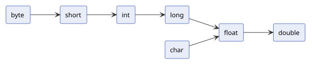

---
hide:
  - navigation
---

# 타입 캐스팅

[← Java로 돌아가기](index.md)

타입 캐스팅은 하나의 타입을 다른 타입으로 변환하는 것입니다. **묵시적 변환(widening)**과 **명시적 변환(narrowing)**으로 구분됩니다.

| 구성 요소 | 설명 |
|---|---|
| 묵시적 변환 (Widening) | 작은 타입에서 큰 타입으로 자동 변환 |
| 명시적 변환 (Narrowing) | 큰 타입에서 작은 타입으로 직접 명시해 변환 |

---

## 1. 묵시적 변환 (Widening)

작은 타입에서 큰 타입으로 자동 변환됩니다. 데이터 손실이 없으므로 별도 문법 없이 컴파일러가 처리합니다.

{ width="600" }

```java
public class WideningExample {
    public static void main(String[] args) {
        int intValue = 100;
        long longValue = intValue;      // 자동 변환
        double doubleValue = intValue;  // 자동 변환

        System.out.println(longValue);    // 100
        System.out.println(doubleValue);  // 100.0
    }
}
```

```
100
100.0
```

## 2. 명시적 변환 (Narrowing)

큰 타입에서 작은 타입으로 변환할 때는 데이터 손실 가능성이 있으므로 **캐스트 연산자**를 사용해 변환할 타입을 직접 명시해야 합니다. 대상 타입의 허용 범위를 벗어나면 초과분이 잘려나가 예상과 다른 값이 나올 수 있습니다.

- 캐스트 연산자: 변환할 타입을 `()` 안에 명시해 강제로 형변환하는 연산자입니다.

```java
public class NarrowingExample {
    public static void main(String[] args) {
        double doubleValue = 9.99;
        int intValue = (int) doubleValue;  // (int): double → int로 변환, 소수점 이하 버림

        int big = 300;
        byte byteValue = (byte) big;  // (byte): int → byte로 변환, byte 범위(-128~127) 초과로 값이 잘림

        System.out.println(intValue);   // 9
        System.out.println(byteValue);  // 44
    }
}
```

```
9
44
```
