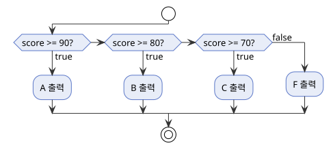
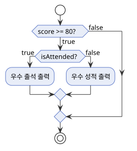
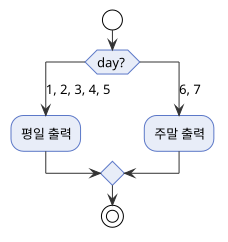
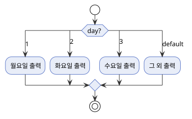

---
hide:
  - navigation
---

# 조건문

[← Java로 돌아가기](index.md)

조건식의 결과에 따라 실행할 코드 블록을 선택합니다.

| 구성 요소 | 설명 |
|---|---|
| if / else if / else | 조건식이 `true`인 블록을 순서대로 찾아 실행 |
| switch | 하나의 값을 여러 `case`와 비교해 실행 |

---

## 1. if / else if / else

조건이 `true`인 블록을 순서대로 찾아 실행하고, 나머지는 건너뜁니다.

| 형태 | 의미 |
|------|------|
| `if (조건)` | 조건이 `true`이면 블록을 실행합니다. |
| `else if (조건)` | 위 조건이 `false`이고 이 조건이 `true`이면 실행합니다. |
| `else` | 위의 모든 조건이 `false`이면 실행합니다. |

`else if`와 `else`는 필요할 때만 붙이며, 생략할 수 있습니다.

{ width="600" }

```java
public class IfExample {
    public static void main(String[] args) {
        int score = 75;

        if (score >= 90) {
            System.out.println("A");
        } else if (score >= 80) {
            System.out.println("B");
        } else if (score >= 70) {
            System.out.println("C");
        } else {
            System.out.println("F");
        }
    }
}
```

```
C
```

`if` 블록 안에 다시 `if`를 작성하는 것을 중첩 `if`라고 합니다.

{ width="450" }

```java
public class NestedIfExample {
    public static void main(String[] args) {
        int score = 85;
        boolean isAttended = true;

        if (score >= 80) {
            if (isAttended) {
                System.out.println("우수 출석");
            } else {
                System.out.println("우수 성적");
            }
        }
    }
}
```

```
우수 출석
```

## 2. switch

하나의 값을 여러 `case`와 비교하여 일치하는 블록을 실행합니다.

| 형태 | 의미 |
|------|------|
| `case 값:` | 값이 일치하면 이 블록부터 실행합니다. |
| `break` | 현재 `case` 블록을 끝내고 `switch`를 빠져나옵니다. |
| `default:` | 일치하는 `case`가 없을 때 실행합니다. |

> `break`를 생략하면 다음 `case`까지 실행이 계속됩니다(fall-through).

{ width="450" }

```java
public class FallThroughExample {
    public static void main(String[] args) {
        int day = 2;

        switch (day) {
            case 1:
            case 2:
            case 3:
            case 4:
            case 5:
                System.out.println("평일");
                break;
            case 6:
            case 7:
                System.out.println("주말");
                break;
        }
    }
}
```

```
평일
```

{ width="600" }

```java
public class SwitchExample {
    public static void main(String[] args) {
        int day = 3;

        switch (day) {
            case 1:
                System.out.println("월요일");
                break;
            case 2:
                System.out.println("화요일");
                break;
            case 3:
                System.out.println("수요일");
                break;
            default:
                System.out.println("그 외");
        }
    }
}
```

```
수요일
```

## 3. switch 표현식 (화살표 문법)

Java 14부터는 `case 값 -> 코드` 형태의 화살표 문법으로 `break` 없이 fall-through 없는 `switch`를 작성할 수 있습니다.

| 형태 | 의미 |
|------|------|
| `case 값 -> 코드` | 값이 일치하면 해당 코드만 실행하고 자동으로 종료됩니다(fall-through 없음). |
| `yield 값` | 블록 형태에서 switch 표현식의 결과값을 반환합니다. |

```java
public class SwitchArrowExample {
    public static void main(String[] args) {
        int day = 3;

        String result = switch (day) {
            case 1, 2, 3, 4, 5 -> "평일";
            case 6, 7 -> "주말";
            default -> "알 수 없음";
        };

        System.out.println(result);
    }
}
```

```
평일
```
