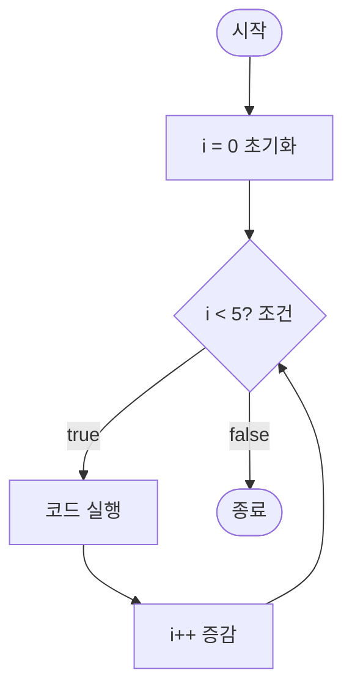
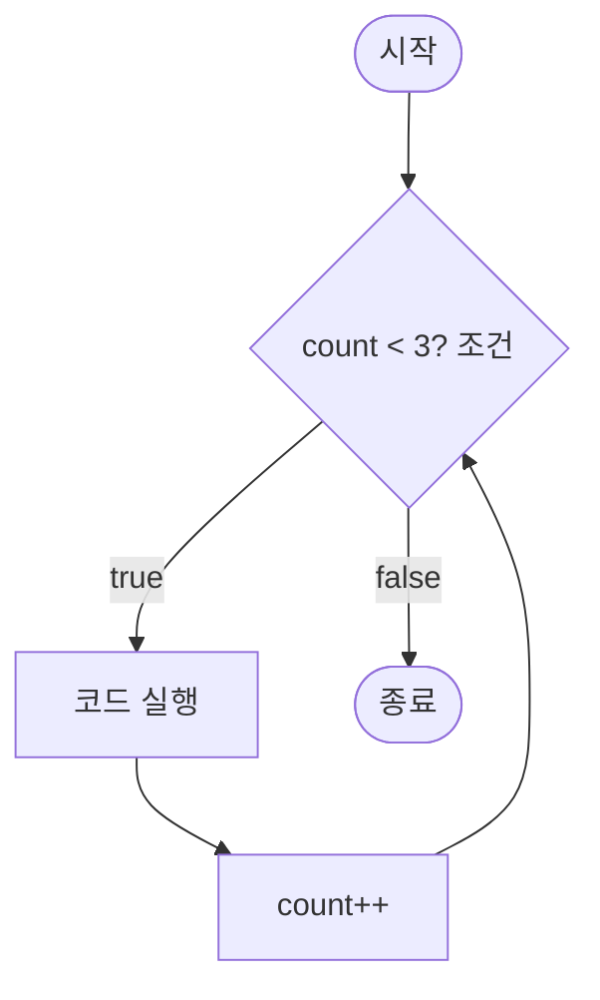
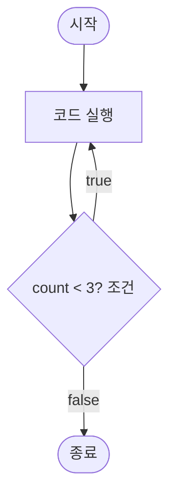
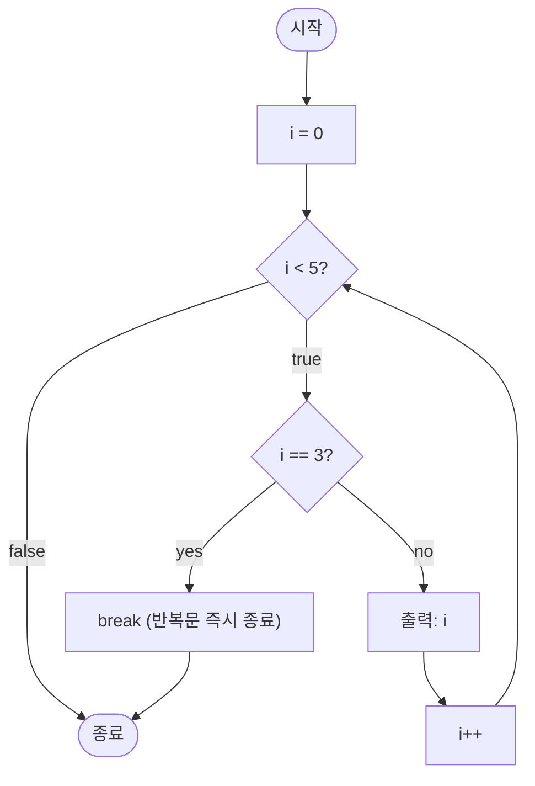
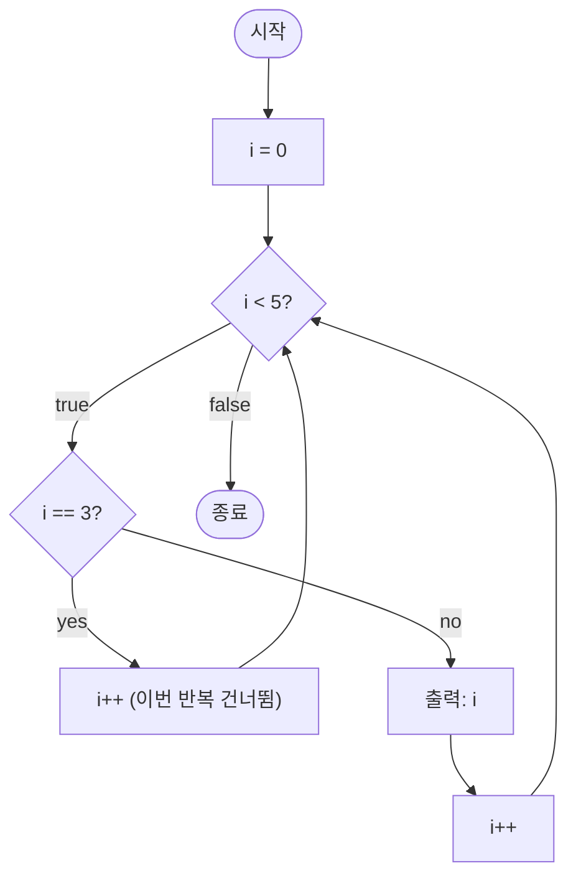

---
hide:
  - navigation
---

# 반복문

[← Java로 돌아가기](index.md)

조건이 만족되는 동안 코드 블록을 반복 실행합니다.

| 구성 요소 | 설명 |
|---|---|
| for | 반복 횟수가 정해진 경우 사용 |
| while | 조건이 `true`인 동안 반복 |
| do-while | 블록을 최소 1회 실행한 뒤 조건 검사 |

---

## 1. for

반복 횟수가 정해진 경우에 사용합니다. `for` 뒤 괄호 안에 초기화·조건·증감식을 한 줄로 작성합니다.

| 구성 요소 | 의미 |
|-----------|------|
| 초기화 | 반복 시작 전 한 번만 실행합니다. (예: `int i = 0`) |
| 조건 | 매 반복 전에 확인하며, `false`가 되면 반복을 멈춥니다. (예: `i < 5`) |
| 증감식 | 매 반복이 끝난 뒤 실행됩니다. (예: `i++`) |



```java
public class ForExample {
    public static void main(String[] args) {
        for (int i = 0; i < 5; i++) {
            System.out.println(i);
        }
    }
}
```

```
0
1
2
3
4
```

!!! info "참고"
    배열이나 컬렉션의 모든 원소를 순회할 때 인덱스 없이 간결하게 작성할 수 있는 **향상된 for(for-each)** 문법도 있습니다. 배열은 이후 문서에서 다룹니다.

---

## 2. while

조건이 `true`인 동안 반복합니다. 반복 횟수를 사전에 알 수 없을 때 사용합니다.

| 구성 요소 | 의미 |
|-----------|------|
| 조건 | 매 반복 전에 확인하며, `false`가 되면 반복을 멈춥니다. (예: `count < 3`) |



```java
public class WhileExample {
    public static void main(String[] args) {
        int count = 0;
        while (count < 3) {
            System.out.println(count);
            count++;
        }
    }
}
```

```
0
1
2
```

---

## 3. do-while

`while`과 달리 조건을 블록 실행 **후**에 검사하므로, 조건이 처음부터 `false`여도 최소 1회는 실행됩니다.



```java
public class DoWhileExample {
    public static void main(String[] args) {
        int count = 0;
        do {
            System.out.println(count);
            count++;
        } while (count < 3);
    }
}
```

```
0
1
2
```

---

## 4. break와 continue

반복문 실행 중 흐름을 제어합니다.

| 키워드 | 동작 |
|--------|------|
| `break` | 반복문 전체를 즉시 종료합니다. |
| `continue` | 이번 반복의 남은 코드를 건너뛰고 다음 반복으로 이동합니다. |

**break 예시** — `i`가 3이 되는 순간 반복문을 종료합니다.



```java
public class BreakExample {
    public static void main(String[] args) {
        for (int i = 0; i < 5; i++) {
            if (i == 3) break;
            System.out.println(i);
        }
    }
}
```

```
0
1
2
```

**continue 예시** — `i`가 3일 때만 건너뛰고 나머지는 출력합니다.



```java
public class ContinueExample {
    public static void main(String[] args) {
        for (int i = 0; i < 5; i++) {
            if (i == 3) continue;
            System.out.println(i);
        }
    }
}
```

```
0
1
2
4
```
