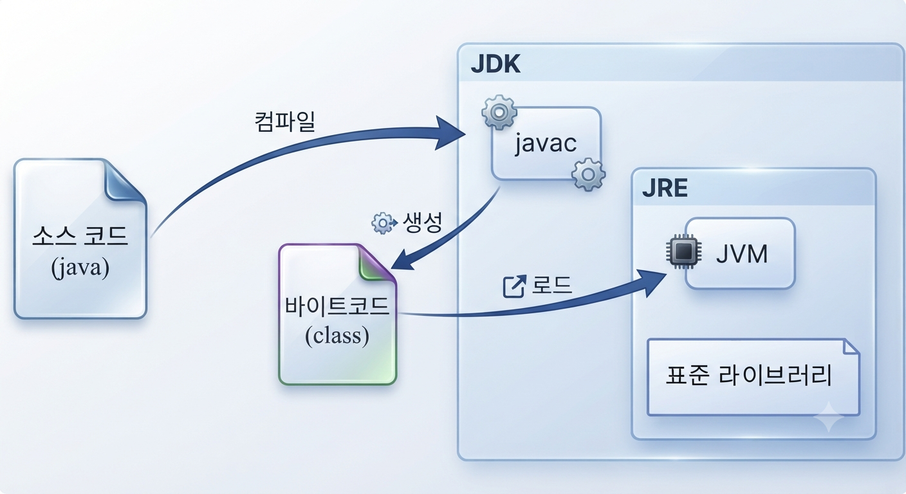

---
hide:
  - navigation
---

# Java 개요

[← Java로 돌아가기](index.md)

Java는 JVM 위에서 실행되는 정적 타입 객체지향 언어로, "한 번 작성하면, 어디서든 실행된다"를 지향합니다. 소스 코드를 한 번 작성해두면, JVM이 설치된 어떤 운영체제에서도 같은 방식으로 실행할 수 있습니다.

{ width="85%" }

| 구성 요소 | 설명 |
|---|---|
| 소스 코드(.java) | 개발자가 작성하는 Java 코드 |
| javac | 소스 코드를 바이트코드로 변환하는 컴파일러 |
| 바이트코드(.class) | 운영체제에 종속되지 않는 중간 코드 |
| JVM | 바이트코드를 해석·실행하는 가상 머신 |
| 표준 라이브러리 | 자주 쓰는 기능을 미리 만들어 제공하는 라이브러리 |
| JRE | JVM과 표준 라이브러리를 묶어 실행 환경만 제공하는 배포판 |
| JDK | JRE에 javac 등 개발 도구를 더한 배포판 |

전체 그림을 이해하려면 소스 코드가 실행되기까지 거치는 세 단계를 알아야 합니다. 사람이 작성하는 **소스 코드(.java)**, 이를 컴파일러가 변환한 **바이트코드(.class)**, 그리고 바이트코드를 실제로 실행하는 **JVM**입니다. 이 실행 환경을 배포 형태로 묶은 것이 JRE와 JDK입니다.

---

## 1. javac의 바이트코드 변환

Java 소스 코드는 사람이 읽고 쓰는 텍스트 형태의 `.java` 파일입니다. 이 상태로는 실행할 수 없고, `javac` 컴파일러가 이를 `.class` 확장자의 바이트코드로 변환해야 합니다. 이 변환 과정을 **컴파일타임**이라 부르고, 이후 JVM이 바이트코드를 읽어 실행하는 과정을 **런타임**이라 부릅니다.

- 컴파일: 사람이 작성한 소스 코드를 JVM이 실행할 수 있는 형태로 변환하는 과정입니다.

```bash
javac Main.java    # 컴파일타임: Main.class 생성
java Main          # 런타임: JVM이 Main.class 실행
```

설치와 프로젝트 생성 및 실행은 [개발환경 설정](setup.md)에서 다룹니다.

!!! summary "요약"
    javac는 소스 코드를 운영체제에 종속되지 않는 중간 형태인 바이트코드로 변환하는 첫 단계입니다.

## 2. 바이트코드의 플랫폼 독립성

바이트코드는 특정 CPU나 운영체제를 겨냥한 기계어가 아니라, JVM만이 이해하는 중간 형태의 코드입니다. 이 덕분에 같은 `.class` 파일을 운영체제 어디서든 JVM만 있으면 그대로 실행할 수 있습니다.

- CPU: 명령어를 실제로 읽고 계산하고 처리하는 중앙 처리 장치 입니다.
- 운영체제: CPU와 하드웨어 자원을 관리하며 프로그램 실행 환경을 제공하는 소프트웨어입니다. Windows, Linux, macOS 등이 있습니다.

!!! summary "요약"
    바이트코드는 특정 플랫폼에 묶이지 않는 중간 코드이며, "한 번 작성하면, 어디서든 실행된다"를 가능하게 하는 핵심입니다.

## 3. JVM의 바이트코드 실행

JVM(Java Virtual Machine)은 바이트코드를 읽어 각 운영체제에 맞는 명령으로 해석·실행하는 소프트웨어입니다. 프로그램 실행에 필요한 메모리 공간을 마련하고, 더 이상 사용하지 않는 데이터를 자동으로 정리해 메모리를 관리하는 일도 JVM이 담당합니다.

- 메모리: 프로그램이 실행되는 동안 데이터를 저장해두는 공간입니다.

!!! summary "요약"
    JVM은 바이트코드와 운영체제 사이를 중개하는 실행 엔진이며, Java가 플랫폼 독립성을 갖게 되는 이유입니다.

## 4. JDK와 JRE의 구성

JRE(Java Runtime Environment)는 JVM과 표준 라이브러리를 묶어 바이트코드를 실행만 할 수 있게 제공하는 배포판입니다. JDK(Java Development Kit)는 여기에 javac 같은 컴파일러와 개발 도구를 더해, 코드를 작성하고 컴파일까지 할 수 있게 해줍니다. 설치 방법은 [개발환경 설정](setup.md)에서 다룹니다.

!!! summary "요약"
    JRE는 실행 환경만 제공하고, JDK는 여기에 개발 도구를 더해 개발부터 실행까지 지원합니다.
