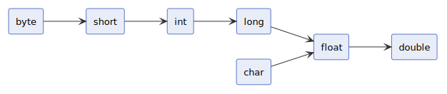
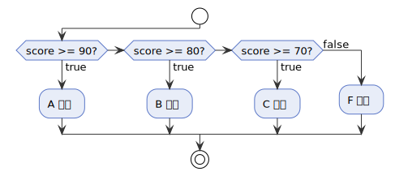
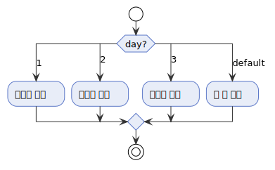
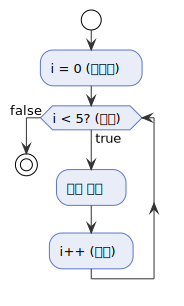
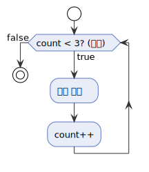
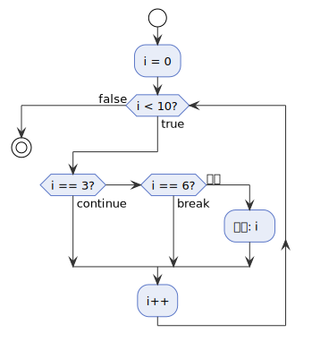

---
hide:
  - navigation
---

# 기본 문법

[← Java로 돌아가기](index.md)

## 1. 프로그램 구조

Java 프로그램은 `class` 안의 **`main` 메서드**에서 시작합니다.

- **메서드(method)**: 특정 작업을 수행하는 코드 묶음입니다. `main` 메서드는 프로그램 시작 시 자동으로 실행됩니다.
- **`class`**: 코드를 담는 그릇으로, 모든 코드는 반드시 `class` 안에 있어야 합니다.

```java
public class Hello {
    public static void main(String[] args) {
        // 여기에 코드를 작성합니다
    }
}
```

*지금은 `main` 메서드 안에 코드를 작성한다는 것만 기억하면 됩니다.*

| 부분 | 역할 |
|------|------|
| `public class Hello` | 클래스 이름을 `Hello`로 정합니다. 이 이름은 직접 정할 수 있으며, 파일명(`Hello.java`)과 반드시 같아야 합니다. |
| `public static void main(String[] args)` | 프로그램 시작 시 가장 먼저 실행되는 진입점입니다. |

---

## 2. 출력

`System.out`은 표준 출력(화면)을 가리키는 객체이고, `println`은 값을 출력하는 메서드 이름입니다. 줄 바꿈 여부에 따라 두 가지 메서드를 구분합니다.

### 2.1 println과 print

`println`은 출력 후 줄 바꿈을 추가하고, `print`는 줄 바꿈 없이 이어서 출력합니다.

```java
public class PrintExample {
    public static void main(String[] args) {
        System.out.println("Hello, World!");  // 출력 후 줄 바꿈

        System.out.print("Hello");            // 줄 바꿈 없이 출력
        System.out.print(", World!");         // 앞 줄과 이어짐
        System.out.println();                 // 줄 바꿈

        System.out.println(42);               // 정수, 실수, 논리값도 출력 가능
        System.out.println(3.14);
        System.out.println(true);
    }
}
```

```
Hello, World!
Hello, World!
42
3.14
true
```

---

## 3. 타입

타입은 저장할 수 있는 값의 종류와 크기를 정의합니다. Java의 타입은 **기본 타입**과 **참조 타입**으로 구분됩니다.

### 3.1 기본 타입 (Primitive Type)

값 자체를 직접 저장하는 8가지 타입입니다.

| 타입 | 종류 | 크기 | 기본값 | 범위 |
|------|------|------|--------|------|
| `byte` | 정수 | 1 byte | `0` | -128 ~ 127 |
| `short` | 정수 | 2 byte | `0` | -32,768 ~ 32,767 |
| `int` | 정수 | 4 byte | `0` | 약 -21억 ~ 21억 |
| `long` | 정수 | 8 byte | `0L` | 약 -922경 ~ 922경 |
| `float` | 실수 | 4 byte | `0.0f` | 소수점 약 7자리 |
| `double` | 실수 | 8 byte | `0.0` | 소수점 약 15자리 |
| `char` | 문자 | 2 byte | `'\0'` | 0 ~ 65,535 (유니코드) |
| `boolean` | 논리 | 1 byte | `false` | true / false |

> 접미사가 없으면 정수는 `int`, 실수는 `double`로 처리됩니다. `long`은 `L`, `float`은 `f`를 붙여 구분합니다 (예: `100L`, `3.14f`).

- **유니코드(Unicode)** — 전 세계 문자를 하나의 숫자 번호로 표현하는 국제 표준입니다. 예: `'A'`=65, `'가'`=44032.

### 3.2 참조 타입 (Reference Type)

객체를 가리키는 타입입니다. 기본 타입이 값 자체를 저장하는 것과 달리, 참조 타입은 객체가 있는 메모리 위치(주소)를 저장합니다. `null`을 가질 수 있습니다.

- **객체**: 데이터와 기능을 하나로 묶은 단위입니다.
- **메모리**: 프로그램 실행 중 데이터를 저장하는 공간입니다.

- **`null`**: 아무것도 가리키지 않는 상태입니다. 기본 타입은 `null`을 가질 수 없습니다.

> 참조 타입 전반은 [클래스와 객체](class-object.md) 섹션에서 자세히 다룹니다.

---

## 4. 변수

변수는 값을 저장하는 메모리 공간에 붙인 이름입니다. 선언 시 타입을 명시합니다.

### 4.1 변수의 속성

변수는 세 가지 속성을 가집니다.

- **값(Value)**: 변수에 저장된 실제 데이터입니다.
- **크기(Size)**: 타입마다 차지하는 메모리 크기가 다릅니다.
- **주소(Address)**: 값이 저장된 메모리 위치입니다. 참조 타입에서 중요하게 쓰입니다.

### 4.2 변수의 선언과 초기화

선언은 타입과 변수명을 지정해 메모리 공간을 확보하고, 초기화는 선언된 변수에 처음 값을 할당하는 것입니다.

```java
public class VariableExample {
    public static void main(String[] args) {
        // 선언: 타입과 변수명만 지정
        int age;

        // 초기화: 선언 후 값 할당
        age = 30;

        // 선언 및 초기화: 선언과 동시에 값 할당
        int count = 0;
        double pi = 3.14159;
        long population = 8_000_000_000L;  // L: long 접미사 (int 범위 초과 시 필수), _는 숫자 가독성을 위한 구분자
        char grade = 'A';
        boolean isActive = true;

        System.out.println(age);         // 30
        System.out.println(count);       // 0
        System.out.println(pi);          // 3.14159
        System.out.println(population);  // 8000000000
        System.out.println(grade);       // A
        System.out.println(isActive);    // true
    }
}
```

```
30
0
3.14159
8000000000
A
true
```

코드에 직접 쓴 값(예: `30`, `3.14159`, `'A'`)을 **리터럴**이라고 합니다.

> 값을 변수에 저장할 때 쓰는 `=`는 **대입 연산자**입니다. [9. 연산자](#9-연산자)에서 자세히 다룹니다.

### 4.3 변수의 명명 규칙

변수명은 **camelCase**로 작성합니다. 첫 글자는 소문자이며, 이후 단어의 첫 글자를 대문자로 씁니다.

```java
public class NamingExample {
    public static void main(String[] args) {
        int maxRetryCount = 3;
        boolean isActive = true;
    }
}
```

---

## 5. String 클래스

`String`은 문자열을 저장하는 **참조 타입**입니다.

### 5.1 선언

큰따옴표(`"`)로 감싼 문자열을 `String` 변수에 저장합니다.

```java
public class StringDeclareExample {
    public static void main(String[] args) {
        String name = "홍길동";
        String greeting = "안녕하세요";
        String empty = "";      // 빈 문자열
        String nothing = null;  // 아무것도 가리키지 않는 상태

        System.out.println(name);      // 홍길동
        System.out.println(greeting);  // 안녕하세요
    }
}
```

```
홍길동
안녕하세요
```

### 5.2 주요 메서드

`String`은 문자열을 다루는 메서드를 제공합니다. `변수명.메서드명()` 형태로 호출합니다.

> 메서드 전반은 [13. 메서드](#13-메서드)에서 자세히 다룹니다.

| 메서드 | 설명 | 반환 타입 |
|--------|------|-----------|
| `length()` | 문자열 길이를 반환합니다. | `int` |
| `charAt(index)` | 특정 위치의 문자를 반환합니다. 인덱스는 0부터 시작합니다. | `char` |
| `substring(start, end)` | `start`부터 `end` 직전까지의 부분 문자열을 반환합니다. | `String` |
| `toUpperCase()` | 모든 문자를 대문자로 변환합니다. | `String` |
| `toLowerCase()` | 모든 문자를 소문자로 변환합니다. | `String` |
| `contains(str)` | 특정 문자열이 포함되면 `true`를 반환합니다. | `boolean` |

```java
public class StringMethodExample {
    public static void main(String[] args) {
        String word = "Hello";

        System.out.println(word.length());         // 5
        System.out.println(word.charAt(0));        // H
        System.out.println(word.substring(1, 3));  // el
        System.out.println(word.toUpperCase());    // HELLO
        System.out.println(word.toLowerCase());    // hello
    }
}
```

```
5
H
el
HELLO
hello
```

> 문자열 **연결**과 **비교**는 [9. 연산자](#9-연산자)에서 다룹니다.

---

## 6. 상수

상수는 `final` 키워드로 선언한 변수로, 최초 초기화 이후 값을 변경할 수 없습니다.

### 6.1 선언과 초기화

변수 선언 앞에 `final`을 붙이면 상수가 됩니다. 선언과 동시에 초기화해야 하며, 이후 재할당을 시도하면 오류가 발생합니다.

```java
public class ConstantExample {
    public static void main(String[] args) {
        final int MAX_SIZE = 100;
        final double PI = 3.14159;
        final String APP_NAME = "MyApp";

        System.out.println(MAX_SIZE);   // 100
        System.out.println(PI);         // 3.14159
        System.out.println(APP_NAME);   // MyApp
    }
}
```

```
100
3.14159
MyApp
```

> 클래스 전체에서 공유하는 상수(`static final`)는 [클래스와 객체](class-object.md)에서 다룹니다.

### 6.2 명명 규칙

상수명은 **UPPER_SNAKE_CASE**로 작성합니다. 변수의 camelCase와 구분하기 위해 모든 글자를 대문자로 쓰고, 단어 사이는 언더스코어(`_`)로 구분합니다.

```java
public class ConstantNamingExample {
    public static void main(String[] args) {
        final int MAX_RETRY_COUNT = 3;
        final double DEFAULT_TIMEOUT = 30.0;
        final String BASE_URL = "https://api.example.com";

        System.out.println(MAX_RETRY_COUNT);   // 3
        System.out.println(DEFAULT_TIMEOUT);   // 30.0
        System.out.println(BASE_URL);          // https://api.example.com
    }
}
```

```
3
30.0
https://api.example.com
```

---

## 7. 입력

키보드로 입력받으려면 `Scanner`를 사용합니다.

### 7.1 선언과 사용

`new Scanner(System.in)`으로 Scanner를 만든 뒤, 타입에 맞는 메서드로 값을 읽습니다.

```java
import java.util.Scanner; // Scanner를 사용하기 위해 필요한 선언

public class InputExample {
    public static void main(String[] args) {
        Scanner scanner = new Scanner(System.in);

        System.out.print("이름 입력: ");
        String name = scanner.nextLine();

        System.out.println("안녕, " + name);
        scanner.close();
    }
}
```

```
이름 입력: 홍길동
안녕, 홍길동
```

### 7.2 주요 메서드

| 메서드 | 반환 타입 | 설명 |
|--------|-----------|------|
| `nextInt()` | `int` | 정수 1개를 읽음 |
| `nextDouble()` | `double` | 실수 1개를 읽음 |
| `next()` | `String` | 공백 기준 단어 1개를 읽음 |
| `nextLine()` | `String` | 줄 바꿈까지 한 줄을 읽음 |
| `close()` | `void` | 사용이 끝난 Scanner를 닫아 자원을 반환함. 사용 후 닫는 것이 관례 |

---

## 8. 타입 캐스팅

타입 캐스팅은 하나의 타입을 다른 타입으로 변환하는 것입니다. **묵시적 변환(widening)**과 **명시적 변환(narrowing)**으로 구분됩니다.

### 8.1 묵시적 변환 (Widening)

작은 타입에서 큰 타입으로 자동 변환됩니다. 데이터 손실이 없으므로 캐스트 연산자 없이 컴파일러가 처리합니다.

{ width="600" }

```java
public class WideningExample {
    public static void main(String[] args) {
        int intValue = 100;
        long longValue = intValue;      // 자동 변환
        double doubleValue = intValue;  // 자동 변환
    }
}
```

### 8.2 명시적 변환 (Narrowing)

큰 타입에서 작은 타입으로 변환할 때는 데이터 손실 가능성이 있으므로 캐스트 연산자를 명시해야 합니다.

```java
public class NarrowingExample {
    public static void main(String[] args) {
        double doubleValue = 9.99;
        int intValue = (int) doubleValue;      // 9 (소수점 버림)

        int big = 300;
        byte byteValue = (byte) big;  // 44 (오버플로우 발생)
    }
}
```

### 8.3 용어 사전

- **오버플로우(Overflow)** — 타입의 표현 범위를 초과하면 값이 최솟값부터 다시 순환됩니다. `byte`의 범위는 -128 ~ 127이므로 `(byte) 300`은 300 − 256 = 44가 됩니다.

---

## 9. 연산자

연산자는 값을 계산하거나 비교·조합할 때 사용하는 기호입니다.

### 9.1 산술 연산자

숫자 타입에 적용하며, `/`는 정수끼리 연산하면 소수점을 버립니다.

| 연산자 | 의미 | 예시 |
|--------|------|------|
| `+` | 왼쪽 값과 오른쪽 값을 더한 값을 반환합니다. | `10 + 3` → `13` |
| `-` | 왼쪽 값에서 오른쪽 값을 뺀 값을 반환합니다. | `10 - 3` → `7` |
| `*` | 왼쪽 값과 오른쪽 값을 곱한 값을 반환합니다. | `10 * 3` → `30` |
| `/` | 왼쪽 값을 오른쪽 값으로 나눈 몫을 반환합니다. 정수끼리는 소수점을 버립니다. | `10 / 3` → `3` |
| `%` | 왼쪽 값을 오른쪽 값으로 나눈 나머지를 반환합니다. | `10 % 3` → `1` |

```java
public class ArithmeticExample {
    public static void main(String[] args) {
        int sum       = 10 + 3;  // 13
        int diff      = 10 - 3;  // 7
        int product   = 10 * 3;  // 30
        int quotient  = 10 / 3;  // 3  (소수점 버림)
        int remainder = 10 % 3;  // 1  (나머지)
    }
}
```

> `+`는 `String`과 함께 쓰면 문자열을 이어 붙입니다. 문자열과 다른 타입을 `+`로 연결하면 자동으로 문자열로 변환됩니다.

```java
public class StringConcatExample {
    public static void main(String[] args) {
        String name = "지수";
        int age = 25;

        System.out.println("이름: " + name);             // 이름: 지수
        System.out.println("나이: " + age);               // 나이: 25
        System.out.println(name + "님은 " + age + "살");  // 지수님은 25살
    }
}
```

```
이름: 지수
나이: 25
지수님은 25살
```

### 9.2 비교 연산자

두 값을 비교해 `boolean`을 반환합니다.

| 연산자 | 의미 |
|--------|------|
| `==` | 두 값이 같으면 `true`를 반환합니다. |
| `!=` | 두 값이 다르면 `true`를 반환합니다. |
| `<` | 왼쪽 값이 오른쪽 값보다 작으면 `true`를 반환합니다. |
| `>` | 왼쪽 값이 오른쪽 값보다 크면 `true`를 반환합니다. |
| `<=` | 왼쪽 값이 오른쪽 값보다 작거나 같으면 `true`를 반환합니다. |
| `>=` | 왼쪽 값이 오른쪽 값보다 크거나 같으면 `true`를 반환합니다. |

> **문자열 비교**: `==`은 두 변수가 같은 메모리 주소를 가리키는지 비교합니다. 문자열 내용을 비교할 때는 반드시 **`equals()`** 메서드를 사용하세요.

```java
public class StringEqualsExample {
    public static void main(String[] args) {
        String a = "hello";
        String b = "hello";

        System.out.println(a.equals(b));  // true (내용 비교)
    }
}
```

```
true
```

### 9.3 논리 연산자

`boolean` 값을 조합합니다. `&&`와 `||`는 단락 평가를 수행합니다.

| 연산자 | 의미 |
|--------|------|
| `&&` | 두 피연산자가 모두 `true`이면 `true`를 반환합니다. |
| `||` | 두 피연산자 중 하나라도 `true`이면 `true`를 반환합니다. |
| `!` | 피연산자의 논리값을 반전해 반환합니다. |

```java
public class LogicalExample {
    public static void main(String[] args) {
        boolean a = true, b = false;
        System.out.println(a && b);  // false (AND)
        System.out.println(a || b);  // true  (OR)
        System.out.println(!a);      // false (NOT)
    }
}
```

### 9.4 대입 연산자

`=`로 값을 할당하며, 산술 연산과 결합한 복합 대입 연산자로 코드를 줄일 수 있습니다.

| 연산자 | 의미 |
|--------|------|
| `=` | 오른쪽 값을 왼쪽 변수에 할당합니다. |
| `+=` | 변수에 오른쪽 값을 더한 뒤 할당합니다. |
| `-=` | 변수에서 오른쪽 값을 뺀 뒤 할당합니다. |
| `*=` | 변수에 오른쪽 값을 곱한 뒤 할당합니다. |
| `/=` | 변수를 오른쪽 값으로 나눈 몫을 할당합니다. |
| `%=` | 변수를 오른쪽 값으로 나눈 나머지를 할당합니다. |

```java
public class AssignmentExample {
    public static void main(String[] args) {
        int count = 10;
        count += 5;   // count = count + 5  → 15
        count -= 3;   // count = count - 3  → 12
        count *= 2;   // count = count * 2  → 24
        count /= 4;   // count = count / 4  → 6
        count %= 4;   // count = count % 4  → 2
    }
}
```

### 9.5 증감 연산자

변수 값을 1 증가(`++`)하거나 감소(`--`)합니다. 전위는 연산 전, 후위는 연산 후에 값이 변합니다.

| 연산자 | 형태 | 동작 |
|--------|------|------|
| `++` | 전위 (`++x`) | 변수를 1 증가시킨 뒤 값을 반환합니다. |
| `++` | 후위 (`x++`) | 현재 값을 반환한 뒤 변수를 1 증가시킵니다. |
| `--` | 전위 (`--x`) | 변수를 1 감소시킨 뒤 값을 반환합니다. |
| `--` | 후위 (`x--`) | 현재 값을 반환한 뒤 변수를 1 감소시킵니다. |

```java
public class IncrementExample {
    public static void main(String[] args) {
        int x = 5;
        System.out.println(x++);  // 5 (현재 값 출력 후 증가 → x = 6)
        System.out.println(++x);  // 7 (증가 후 출력 → x = 7)
    }
}
```

### 9.6 삼항 연산자

`조건 ? 참일 때 값 : 거짓일 때 값` 형태로, `if-else`를 한 줄로 표현합니다.

| 부분 | 역할 |
|------|------|
| `조건` | 평가할 `boolean` 표현식입니다. |
| `참일 때 값` | 조건이 `true`이면 이 값을 반환합니다. |
| `거짓일 때 값` | 조건이 `false`이면 이 값을 반환합니다. |

```java
public class TernaryExample {
    public static void main(String[] args) {
        int score = 75;
        String result = (score >= 60) ? "합격" : "불합격";
        System.out.println(result);  // 합격
    }
}
```

### 9.7 용어 사전

- **단락 평가(Short-circuit evaluation)** — `&&`는 왼쪽이 `false`이면 오른쪽을 평가하지 않고, `||`는 왼쪽이 `true`이면 오른쪽을 평가하지 않습니다. 불필요한 연산을 건너뛰거나 NPE를 방지할 때 활용합니다.

---

## 10. 조건문

조건식의 결과에 따라 실행할 코드 블록을 선택합니다.

### 10.1 if / else if / else

`if`는 조건이 `true`일 때 블록을 실행합니다. `else if`로 추가 조건을, `else`로 모든 조건이 `false`일 때의 처리를 지정합니다.

{ width="600" }

```java
public class IfExample {
    public static void main(String[] args) {
        int score = 75;

        if (score >= 90) {
            System.out.println("A");
        } else if (score >= 80) {
            System.out.println("B");
        } else if (score >= 70) {
            System.out.println("C");
        } else {
            System.out.println("F");
        }
        // 출력: C
    }
}
```

### 10.2 switch

하나의 값을 여러 `case`와 비교합니다. 일치한 `case`부터 실행하고, `break`로 블록을 빠져나옵니다. 일치하는 `case`가 없으면 `default`를 실행합니다.

{ width="600" }

```java
public class SwitchExample {
    public static void main(String[] args) {
        int day = 3;

        switch (day) {
            case 1:
                System.out.println("월요일");
                break;
            case 2:
                System.out.println("화요일");
                break;
            case 3:
                System.out.println("수요일");
                break;
            default:
                System.out.println("그 외");
        }
        // 출력: 수요일
    }
}
```

> Java 14부터 `switch` 표현식과 `->` 화살표 문법이 정식 지원됩니다.

---

## 11. 반복문

조건이 만족되는 동안 코드 블록을 반복 실행합니다.

### 11.1 for

반복 횟수가 정해진 경우에 사용합니다. 초기화·조건·증감식을 한 줄로 표현합니다.

{ width="350" }

```java
public class ForExample {
    public static void main(String[] args) {
        for (int i = 0; i < 5; i++) {
            System.out.println(i);  // 0, 1, 2, 3, 4
        }
    }
}
```

### 11.2 while

조건이 `true`인 동안 반복합니다. 반복 횟수를 사전에 알 수 없을 때 사용합니다.

{ width="350" }

```java
public class WhileExample {
    public static void main(String[] args) {
        int count = 0;
        while (count < 3) {
            System.out.println(count);  // 0, 1, 2
            count++;
        }
    }
}
```

### 11.3 break와 continue

`break`는 반복문을 즉시 종료하고, `continue`는 현재 반복을 건너뛰고 다음 반복으로 이동합니다.

| 키워드 | 동작 |
|--------|------|
| `break` | 반복문 전체를 즉시 종료합니다. |
| `continue` | 이번 반복의 남은 코드를 건너뛰고 다음 반복으로 이동합니다. |

{ width="350" }

```java
public class BreakContinueExample {
    public static void main(String[] args) {
        for (int i = 0; i < 10; i++) {
            if (i == 3) continue;  // 3 건너뜀
            if (i == 6) break;     // 6에서 종료
            System.out.println(i);  // 0, 1, 2, 4, 5
        }
    }
}
```

---

## 12. 배열

배열은 같은 타입의 값을 연속된 메모리에 고정 개수만큼 저장하는 자료구조입니다. 선언 시 크기가 결정되며, 이후 변경할 수 없습니다.

### 12.1 선언과 초기화

타입 뒤에 `[]`를 붙여 선언하며, `new` 키워드로 크기를 지정하거나 중괄호로 초기값을 직접 지정합니다.

```java
public class ArrayExample {
    public static void main(String[] args) {
        // 크기 지정: 기본값으로 초기화 (숫자 → 0, boolean → false, 객체 → null)
        int[] scores = new int[5];

        // 초기값 직접 지정
        int[] primes = {2, 3, 5, 7, 11};
        String[] days = {"월", "화", "수", "목", "금"};
    }
}
```

### 12.2 원소 접근과 수정

인덱스는 `0`부터 시작하며, `배열명[인덱스]`로 원소를 읽거나 씁니다. `배열명.length`로 크기를 얻습니다.

```java
public class ArrayAccessExample {
    public static void main(String[] args) {
        int[] scores = {90, 85, 70, 95, 60};

        System.out.println(scores[0]);      // 90 (첫 번째)
        System.out.println(scores[4]);      // 60 (마지막, length - 1)
        System.out.println(scores.length);  // 5

        scores[2] = 75;                     // 세 번째 원소 수정
        System.out.println(scores[2]);      // 75
    }
}
```

### 12.3 배열 순회

인덱스 기반 `for`문 또는 `for-each`문으로 모든 원소를 순회합니다.

| 방식 | 용도 |
|------|------|
| `for (int i = 0; i < arr.length; i++)` | 인덱스가 필요하거나 원소를 수정할 때 |
| `for (int n : arr)` | 값만 읽을 때 |

```java
public class ArrayLoopExample {
    public static void main(String[] args) {
        int[] numbers = {10, 20, 30, 40, 50};

        // 인덱스 기반 순회
        for (int i = 0; i < numbers.length; i++) {
            System.out.println(i + ": " + numbers[i]);
        }

        // for-each 순회
        for (int n : numbers) {
            System.out.println(n);
        }
    }
}
```

### 12.4 다차원 배열

`[][]`로 2차원 배열을 선언합니다. 행·열 구조로 표나 격자를 표현할 때 사용합니다.

```java
public class TwoDArrayExample {
    public static void main(String[] args) {
        int[][] matrix = {
            {1, 2, 3},
            {4, 5, 6},
            {7, 8, 9}
        };

        System.out.println(matrix[1][2]);  // 6 (2행 3열)

        for (int[] row : matrix) {
            for (int val : row) {
                System.out.print(val + " ");
            }
            System.out.println();
        }
        // 1 2 3
        // 4 5 6
        // 7 8 9
    }
}
```

### 12.5 용어 사전

- **인덱스(Index)** — 배열 원소의 위치를 나타내는 정수. `0`부터 시작하므로 마지막 원소의 인덱스는 `length - 1`입니다. 범위를 벗어나면 런타임 오류가 발생합니다.

---

## 13. 메서드

메서드는 이름이 붙은 코드 블록입니다. 한 번 선언하면 여러 곳에서 반복 호출할 수 있어 코드 중복을 줄입니다.

> `main`과 같은 클래스에서 객체 없이 직접 호출하려면 `static`이어야 합니다. `static`의 의미는 [클래스와 객체](class-object.md) 섹션에서 자세히 설명합니다.

### 13.1 선언과 호출

선언은 반환 타입 → 이름 → 매개변수 순으로 작성합니다. 호출은 이름 뒤에 `()`를 붙입니다.

```java
public class MethodExample {
    static void sayHello() {
        System.out.println("안녕하세요!");
    }

    public static void main(String[] args) {
        sayHello();  // 안녕하세요!
        sayHello();  // 안녕하세요!
    }
}
```

### 13.2 매개변수

호출 시 값을 전달하려면 선언부에 매개변수를 씁니다. 여러 개는 `,`로 구분합니다.

```java
public class ParamExample {
    static void greet(String name, int age) {
        System.out.println(name + "님은 " + age + "살입니다.");
    }

    public static void main(String[] args) {
        greet("지수", 25);  // 지수님은 25살입니다.
        greet("민준", 30);  // 민준님은 30살입니다.
    }
}
```

### 13.3 반환값

값을 돌려줄 때는 반환 타입을 지정하고 `return`으로 값을 반환합니다.

| 구분 | 반환 타입 | `return` |
|------|-----------|----------|
| 반환값 없음 | `void` | 생략 가능 |
| 반환값 있음 | `int`, `String` 등 | 반드시 작성 |

```java
public class ReturnExample {
    static int add(int a, int b) {
        return a + b;
    }

    public static void main(String[] args) {
        int result = add(3, 4);
        System.out.println(result);  // 7
    }
}
```

### 13.4 용어 사전

- **메서드(Method)** — 이름이 있는 코드 블록. 선언 한 번으로 여러 번 호출할 수 있습니다.
- **매개변수(Parameter)** — 메서드 선언부에 작성하는 변수. `greet(String name)`에서 `name`이 매개변수입니다.
- **인수(Argument)** — 메서드 호출 시 실제로 전달하는 값. `greet("지수", 25)`에서 `"지수"`와 `25`가 인수입니다.
- **반환값(Return value)** — `return`으로 메서드 바깥에 돌려보내는 값.
- **void** — 반환값이 없음을 나타내는 키워드.
