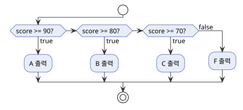
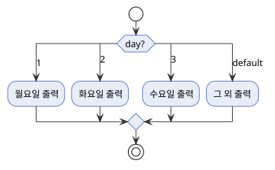
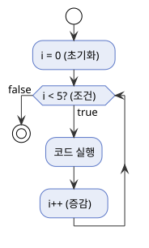
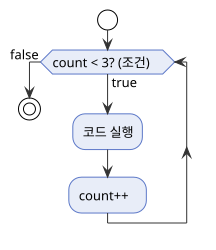
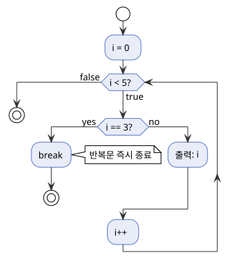
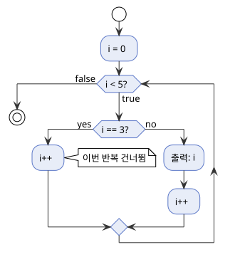

---
hide:
  - navigation
---

# 기본 문법

[← Java로 돌아가기](index.md)

## 1. 입력

키보드로 입력받으려면 `Scanner`를 사용합니다.

### 1.1 선언과 사용

`new Scanner(System.in)`으로 Scanner를 만든 뒤, 타입에 맞는 메서드로 값을 읽습니다.

```java
import java.util.Scanner; // Scanner를 사용하기 위해 필요한 선언

public class InputExample {
    public static void main(String[] args) {
        Scanner scanner = new Scanner(System.in);

        System.out.print("이름 입력: ");
        String name = scanner.nextLine();

        System.out.println("안녕, " + name);
        scanner.close();
    }
}
```

```
이름 입력: 홍길동
안녕, 홍길동
```

### 1.2 주요 메서드

`Scanner`는 입력을 읽는 메서드를 제공합니다. `변수명.메서드명()` 형태로 호출합니다.

!!! info "참고"
    지금은 호출 형태만 익히고, 메서드에 대한 자세한 내용은 [8. 메서드](#8-메서드)를 참고하세요.

| 메서드 | 반환 타입 | 설명 |
|--------|-----------|------|
| `nextInt()` | `int` | 정수 1개를 읽음 |
| `nextDouble()` | `double` | 실수 1개를 읽음 |
| `next()` | `String` | 공백 기준 단어 1개를 읽음 |
| `nextLine()` | `String` | 줄 바꿈까지 한 줄을 읽음 |
| `close()` | `void` | 사용이 끝난 Scanner를 닫아 자원을 반환함. 사용 후 닫는 것이 관례 |

---

## 2. 연산자

연산자는 값을 계산하거나 비교·조합할 때 사용하는 기호입니다.

### 2.1 산술 연산자

두 수를 계산해 결과값을 반환합니다.

| 연산자 | 의미 |
|--------|------|
| `+` | 왼쪽 값과 오른쪽 값을 더한 값을 반환합니다. |
| `-` | 왼쪽 값에서 오른쪽 값을 뺀 값을 반환합니다. |
| `*` | 왼쪽 값과 오른쪽 값을 곱한 값을 반환합니다. |
| `/` | 왼쪽 값을 오른쪽 값으로 나눈 몫을 반환합니다. 정수끼리는 소수점을 버립니다. |
| `%` | 왼쪽 값을 오른쪽 값으로 나눈 나머지를 반환합니다. |

```java
public class ArithmeticExample {
    public static void main(String[] args) {
        int number1 = 10;
        int number2 = 3;

        int sum       = number1 + number2;
        int diff      = number1 - number2;
        int product   = number1 * number2;
        int quotient  = number1 / number2;
        int remainder = number1 % number2;

        System.out.println(sum);        // 13
        System.out.println(diff);       // 7
        System.out.println(product);    // 30
        System.out.println(quotient);   // 3
        System.out.println(remainder);  // 1
    }
}
```

```
13
7
30
3
1
```


### 2.2 대입 연산자

변수에 값을 할당합니다.

| 연산자 | 의미 |
|--------|------|
| `=` | 오른쪽 값을 왼쪽 변수에 할당합니다. |
| `+=` | 변수에 오른쪽 값을 더한 뒤 할당합니다. |
| `-=` | 변수에서 오른쪽 값을 뺀 뒤 할당합니다. |
| `*=` | 변수에 오른쪽 값을 곱한 뒤 할당합니다. |
| `/=` | 변수를 오른쪽 값으로 나눈 몫을 할당합니다. |
| `%=` | 변수를 오른쪽 값으로 나눈 나머지를 할당합니다. |

```java
public class AssignmentExample {
    public static void main(String[] args) {
        int count = 10;

        count += 5;
        System.out.println(count);  // 15

        count -= 3;
        System.out.println(count);  // 12

        count *= 2;
        System.out.println(count);  // 24

        count /= 4;
        System.out.println(count);  // 6

        count %= 4;
        System.out.println(count);  // 2
    }
}
```

```
15
12
24
6
2
```

### 2.3 비교 연산자

두 값을 비교해 `boolean`을 반환합니다.

| 연산자 | 의미 |
|--------|------|
| `==` | 두 값이 같으면 `true`를 반환합니다. |
| `!=` | 두 값이 다르면 `true`를 반환합니다. |
| `<` | 왼쪽 값이 오른쪽 값보다 작으면 `true`를 반환합니다. |
| `>` | 왼쪽 값이 오른쪽 값보다 크면 `true`를 반환합니다. |
| `<=` | 왼쪽 값이 오른쪽 값보다 작거나 같으면 `true`를 반환합니다. |
| `>=` | 왼쪽 값이 오른쪽 값보다 크거나 같으면 `true`를 반환합니다. |

```java
public class ComparisonExample {
    public static void main(String[] args) {
        int number1 = 10;
        int number2 = 3;

        System.out.println(number1 == number2);  // false
        System.out.println(number1 != number2);  // true
        System.out.println(number1 < number2);   // false
        System.out.println(number1 > number2);   // true
        System.out.println(number1 <= number2);  // false
        System.out.println(number1 >= number2);  // true
    }
}
```

```
false
true
false
true
false
true
```

### 2.4 논리 연산자

두 `boolean` 값을 조합해 하나의 `boolean`을 반환합니다.

| 연산자 | 의미 |
|--------|------|
| `&&` | 두 값이 모두 `true`이면 `true`를 반환합니다. |
| `\|\|` | 두 값 중 하나라도 `true`이면 `true`를 반환합니다. |
| `!` | `true`는 `false`로, `false`는 `true`로 반환합니다. |

`&&`는 왼쪽이 `false`이면 오른쪽을 확인하지 않고, `||`는 왼쪽이 `true`이면 오른쪽을 확인하지 않습니다.

```java
public class LogicalExample {
    public static void main(String[] args) {
        boolean a = true;
        boolean b = false;

        System.out.println(a && b);  // false
        System.out.println(a || b);  // true
        System.out.println(!a);      // false
    }
}
```

```
false
true
false
```

### 2.5 증감 연산자

변수의 값을 1씩 증가하거나 감소시킵니다.

| 연산자 | 의미 |
|--------|------|
| `++x` | 변수를 1 증가시킨 뒤 값을 반환합니다. |
| `x++` | 현재 값을 반환한 뒤 변수를 1 증가시킵니다. |
| `--x` | 변수를 1 감소시킨 뒤 값을 반환합니다. |
| `x--` | 현재 값을 반환한 뒤 변수를 1 감소시킵니다. |

```java
public class IncrementExample {
    public static void main(String[] args) {
        int x = 5;
        System.out.println(x++);  // 5 (현재 값 출력 후 증가 → x = 6)
        System.out.println(++x);  // 7 (증가 후 출력 → x = 7)
    }
}
```

```
5
7
```

### 2.6 삼항 연산자

조건에 따라 두 값 중 하나를 반환합니다.

| 형태 | 의미 |
|------|------|
| `조건 ? A : B` | 조건이 `true`이면 `A`, `false`이면 `B`를 반환합니다. |

```java
public class TernaryExample {
    public static void main(String[] args) {
        int score = 75;
        String result = (score >= 60) ? "합격" : "불합격";
        System.out.println(result);
    }
}
```

```
합격
```

### 2.7 String 연산

`String`은 숫자 타입과 달리 `+`로 이어 붙이고, 내용 비교에는 `equals()`를 사용합니다.

#### 문자열 연결

| 형태 | 의미 |
|------|------|
| `+` | 두 문자열을 이어 붙입니다. 다른 타입과 연결하면 자동으로 문자열로 변환됩니다. |

```java
public class StringConcatExample {
    public static void main(String[] args) {
        String name = "지수";
        int age = 25;

        System.out.println("이름: " + name);
        System.out.println("나이: " + age);
        System.out.println(name + "님은 " + age + "살");
    }
}
```

```
이름: 지수
나이: 25
지수님은 25살
```

#### 문자열 비교

| 형태 | 의미 |
|------|------|
| `a.equals(b)` | 두 문자열의 **내용**이 같은지 비교합니다. |
| `a == b` | 두 변수가 같은 **객체**를 가리키는지 비교합니다. 내용이 같아도 `false`가 나올 수 있습니다. |

```java
public class StringEqualsExample {
    public static void main(String[] args) {
        String a = "hello";
        String b = new String("hello");

        System.out.println(a.equals(b));
        System.out.println(a == b);
    }
}
```

```
true
false
```

---

## 3. 조건문

조건식의 결과에 따라 실행할 코드 블록을 선택합니다.

### 3.1 if / else if / else

조건이 `true`인 블록을 순서대로 찾아 실행하고, 나머지는 건너뜁니다.

| 형태 | 의미 |
|------|------|
| `if (조건)` | 조건이 `true`이면 블록을 실행합니다. |
| `else if (조건)` | 위 조건이 `false`이고 이 조건이 `true`이면 실행합니다. |
| `else` | 위의 모든 조건이 `false`이면 실행합니다. |

{ width="600" }

```java
public class IfExample {
    public static void main(String[] args) {
        int score = 75;

        if (score >= 90) {
            System.out.println("A");
        } else if (score >= 80) {
            System.out.println("B");
        } else if (score >= 70) {
            System.out.println("C");
        } else {
            System.out.println("F");
        }
    }
}
```

```
C
```

### 3.2 switch

하나의 값을 여러 `case`와 비교하여 일치하는 블록을 실행합니다.

| 형태 | 의미 |
|------|------|
| `case 값:` | 값이 일치하면 이 블록부터 실행합니다. |
| `break` | 현재 `case` 블록을 끝내고 `switch`를 빠져나옵니다. |
| `default:` | 일치하는 `case`가 없을 때 실행합니다. |

> `break`를 생략하면 다음 `case`까지 실행이 계속됩니다(fall-through).

{ width="600" }

```java
public class SwitchExample {
    public static void main(String[] args) {
        int day = 3;

        switch (day) {
            case 1:
                System.out.println("월요일");
                break;
            case 2:
                System.out.println("화요일");
                break;
            case 3:
                System.out.println("수요일");
                break;
            default:
                System.out.println("그 외");
        }
    }
}
```

```
수요일
```

---

## 4. 반복문

조건이 만족되는 동안 코드 블록을 반복 실행합니다.

### 4.1 for

반복 횟수가 정해진 경우에 사용합니다. `for` 뒤 괄호 안에 초기화·조건·증감식을 한 줄로 작성합니다.

| 구성 요소 | 의미 |
|-----------|------|
| 초기화 | 반복 시작 전 한 번만 실행합니다. (예: `int i = 0`) |
| 조건 | 매 반복 전에 확인하며, `false`가 되면 반복을 멈춥니다. (예: `i < 5`) |
| 증감식 | 매 반복이 끝난 뒤 실행됩니다. (예: `i++`) |

{ width="350" }

```java
public class ForExample {
    public static void main(String[] args) {
        for (int i = 0; i < 5; i++) {
            System.out.println(i);
        }
    }
}
```

```
0
1
2
3
4
```

### 4.2 while

조건이 `true`인 동안 반복합니다. 반복 횟수를 사전에 알 수 없을 때 사용합니다.

| 구성 요소 | 의미 |
|-----------|------|
| 조건 | 매 반복 전에 확인하며, `false`가 되면 반복을 멈춥니다. (예: `count < 3`) |

{ width="350" }

```java
public class WhileExample {
    public static void main(String[] args) {
        int count = 0;
        while (count < 3) {
            System.out.println(count);
            count++;
        }
    }
}
```

```
0
1
2
```

### 4.3 break와 continue

반복문 실행 중 흐름을 제어합니다.

| 키워드 | 동작 |
|--------|------|
| `break` | 반복문 전체를 즉시 종료합니다. |
| `continue` | 이번 반복의 남은 코드를 건너뛰고 다음 반복으로 이동합니다. |

**break 예시** — `i`가 3이 되는 순간 반복문을 종료합니다.

{ width="350" }

```java
public class BreakExample {
    public static void main(String[] args) {
        for (int i = 0; i < 5; i++) {
            if (i == 3) break;
            System.out.println(i);
        }
    }
}
```

```
0
1
2
```

**continue 예시** — `i`가 3일 때만 건너뛰고 나머지는 출력합니다.

{ width="350" }

```java
public class ContinueExample {
    public static void main(String[] args) {
        for (int i = 0; i < 5; i++) {
            if (i == 3) continue;
            System.out.println(i);
        }
    }
}
```

```
0
1
2
4
```

---

## 5. 랜덤 라이브러리

무작위 값이 필요할 때는 `Math.random()` 또는 `Random` 클래스를 사용합니다.

### 5.1 Math.random()

`Math.random()`은 `0.0` 이상 `1.0` 미만의 `double` 값을 무작위로 반환합니다. 원하는 정수 범위로 바꾸려면 곱하고 더한 뒤 `(int)`로 캐스팅합니다.

| 형태 | 의미 |
|------|------|
| `Math.random()` | `0.0` 이상 `1.0` 미만의 `double`을 반환합니다. |
| `(int) (Math.random() * n)` | `0` 이상 `n` 미만의 정수를 반환합니다. |
| `(int) (Math.random() * n) + start` | `start` 이상 `start + n` 미만의 정수를 반환합니다. |

```java
public class MathRandomExample {
    public static void main(String[] args) {
        int dice = (int) (Math.random() * 6) + 1;        // 1 ~ 6
        int fourDigit = (int) (Math.random() * 9000) + 1000;  // 1000 ~ 9999

        System.out.println(dice);
        System.out.println(fourDigit);
    }
}
```

```
4
7392
```

### 5.2 Random 클래스

`Random`은 무작위 값을 생성하는 객체입니다. `new Random()`으로 만든 뒤, 타입에 맞는 메서드로 값을 뽑습니다.

!!! info "참고"
    지금은 호출 형태만 익히고, 메서드에 대한 자세한 내용은 [8. 메서드](#8-메서드)를 참고하세요.

| 메서드 | 반환 타입 | 설명 |
|--------|-----------|------|
| `nextInt()` | `int` | 정수 범위 전체에서 무작위 값을 반환합니다. |
| `nextInt(bound)` | `int` | `0` 이상 `bound` 미만의 무작위 정수를 반환합니다. |
| `nextDouble()` | `double` | `0.0` 이상 `1.0` 미만의 무작위 실수를 반환합니다. |
| `nextBoolean()` | `boolean` | 무작위로 `true` 또는 `false`를 반환합니다. |

```java
import java.util.Random; // Random을 사용하기 위해 필요한 선언

public class RandomExample {
    public static void main(String[] args) {
        Random random = new Random();

        int dice = random.nextInt(6) + 1;  // 1 ~ 6
        System.out.println(dice);
    }
}
```

```
3
```

---

## 6. 배열

배열은 같은 타입의 값을 순서대로 묶어 보관하는 자료구조입니다. 선언할 때 크기가 고정됩니다.

### 6.1 선언과 초기화

타입 뒤에 `[]`를 붙여 선언하며, `new` 키워드로 크기를 지정하거나 중괄호로 초기값을 직접 지정합니다.

```java
public class ArrayExample {
    public static void main(String[] args) {
        // 크기 지정: 숫자 타입은 0으로 초기화
        int[] scores = new int[5];

        // 초기값 직접 지정
        int[] primes = {2, 3, 5, 7, 11};
        String[] days = {"월", "화", "수", "목", "금"};

        System.out.println(scores[0]);   // 기본값: 0
        System.out.println(primes[0]);   // 2
        System.out.println(days[0]);     // 월
    }
}
```

```
0
2
월
```

### 6.2 원소 접근과 수정

배열에 담긴 각 값을 **원소**라 하며, **인덱스**로 접근합니다.

| 용어 | 설명 |
|------|------|
| **원소** | 배열에 담긴 각각의 값 |
| **인덱스** | 원소의 위치를 나타내는 번호. `0`부터 시작하며 마지막은 `length - 1` |

존재하지 않는 인덱스를 사용하면 프로그램 실행 중 오류가 발생합니다.

```java
public class ArrayAccessExample {
    public static void main(String[] args) {
        int[] scores = {90, 85, 70, 95, 60};

        System.out.println(scores[0]);      // 90 (첫 번째)
        System.out.println(scores[4]);      // 60 (마지막, length - 1)
        System.out.println(scores.length);  // 5

        scores[2] = 75;                     // 세 번째 원소 수정
        System.out.println(scores[2]);      // 75
    }
}
```

```
90
60
5
75
```

### 6.3 배열 순회

인덱스 기반 `for`문 또는 `for-each`문으로 모든 원소를 순회합니다. `for-each`는 `for (타입 변수 : 배열)` 형태로, 인덱스 없이 값만 꺼낼 때 사용합니다.

| 방식 | 용도 |
|------|------|
| `for (int i = 0; i < arr.length; i++)` | 인덱스가 필요하거나 원소를 수정할 때. |
| `for (int n : arr)` | 값만 읽을 때. |

```java
public class ArrayLoopExample {
    public static void main(String[] args) {
        int[] numbers = {10, 20, 30, 40, 50};

        // 인덱스 기반 순회
        for (int i = 0; i < numbers.length; i++) {
            System.out.println(i + ": " + numbers[i]);
        }

        // for-each 순회
        for (int n : numbers) {
            System.out.println(n);
        }
    }
}
```

```
0: 10
1: 20
2: 30
3: 40
4: 50
10
20
30
40
50
```

---

## 7. 다차원 배열

배열의 원소가 다시 배열인 구조입니다. 행(row)과 열(column)로 데이터를 표현할 때 사용합니다.

### 7.1 2차원 배열 선언과 초기화

`타입[][] 변수명` 형태로 선언하고, 중첩 중괄호로 초기화합니다.

| 방법 | 예시 | 설명 |
|------|------|------|
| 크기 지정 | `new int[3][4]` | 3행 4열, 기본값 0으로 초기화. |
| 값 지정 | `{ {1,2}, {3,4} }` | 선언과 동시에 값 할당. |

```java
public class TwoDimArrayExample {
    public static void main(String[] args) {
        int[][] grid = new int[3][4];         // 3행 4열, 기본값 0
        int[][] matrix = { {1, 2}, {3, 4} };  // 2행 2열

        System.out.println(grid[0][0]);    // 0
        System.out.println(matrix[0][1]);  // 2
        System.out.println(matrix[1][0]);  // 3
    }
}
```

```
0
2
3
```

### 7.2 2차원 배열 순회

중첩 `for`문으로 행과 열을 순서대로 접근합니다.

```java
public class TwoDimLoopExample {
    public static void main(String[] args) {
        int[][] matrix = {
            {1, 2, 3},
            {4, 5, 6},
            {7, 8, 9}
        };

        for (int row = 0; row < matrix.length; row++) {
            for (int col = 0; col < matrix[row].length; col++) {
                System.out.print(matrix[row][col] + " ");
            }
            System.out.println();
        }
    }
}
```

```
1 2 3 
4 5 6 
7 8 9 
```

---

## 8. 메서드

메서드는 이름이 붙은 코드 블록입니다. 한 번 선언하면 여러 곳에서 반복 호출할 수 있어 코드 중복을 줄입니다.

### 8.1 선언과 호출

선언은 `반환 타입 → 이름 → 매개변수` 순으로 작성합니다. 반환할 값이 없으면 반환 타입으로 `void`를 씁니다. 호출은 이름 뒤에 `()`를 붙입니다.

```java
public class MethodExample {
    static void sayHello() {  // void: 반환값 없음
        System.out.println("안녕하세요!");
    }

    public static void main(String[] args) {
        sayHello();  // 안녕하세요!
        sayHello();  // 안녕하세요!
    }
}
```

```
안녕하세요!
안녕하세요!
```

!!! info "참고"
    `main`과 같은 클래스에서 객체 없이 직접 호출하려면 `static`이어야 합니다. 자세한 내용은 [클래스와 객체](class-object.md)를 참고하세요.

### 8.2 매개변수

**매개변수**는 메서드를 선언할 때 지정하는 변수 이름이고, **인수**는 호출할 때 실제로 전달하는 값입니다. 여러 개는 `,`로 구분합니다.

```java
public class ParamExample {
    static void greet(String name, int age) {  // name, age: 매개변수
        System.out.println(name + "님은 " + age + "살입니다.");
    }

    public static void main(String[] args) {
        greet("지수", 25);  // "지수", 25: 인수
        greet("민준", 30);
    }
}
```

```
지수님은 25살입니다.
민준님은 30살입니다.
```

### 8.3 반환값

값을 돌려줄 때는 반환 타입을 지정하고 `return`으로 값을 반환합니다.

| 구분 | 반환 타입 | `return` |
|------|-----------|----------|
| 반환값 없음 | `void` | 생략함. |
| 반환값 있음 | `int`, `String` 등 | 반드시 작성. |

```java
public class ReturnExample {
    static int add(int a, int b) {
        return a + b;
    }

    public static void main(String[] args) {
        int result = add(3, 4);
        System.out.println(result);  // 7
    }
}
```

```
7
```
