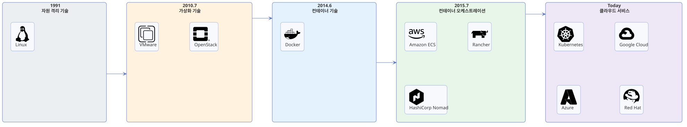

---
hide:
  - toc
---

# 쿠버네티스의 역사

[← Kubernetes로 돌아가기](index.md)

쿠버네티스는 어느 날 갑자기 등장한 기술이 아니라, 자원 격리 → 가상화 → 컨테이너 → 오케스트레이션으로 이어지는 흐름 속에서 탄생했습니다.

{ width="100%" }

---

## 1991 — Linux (자원 격리)

리눅스 커널의 `chroot`, `namespace`, `cgroup` 기능은 프로세스 단위로 자원을 격리하는 기반 기술입니다. 이후 컨테이너 기술의 토대가 되었습니다.

## 2010.7 — VM (가상화)

VirtualBox, VMware, KVM, Xen 등 하이퍼바이저 기반 가상화 기술이 널리 쓰이기 시작했습니다. Rackspace와 NASA가 공동 개발한 OpenStack은 이런 가상 인프라를 관리하는 클라우드 플랫폼으로 등장했습니다.

## 2014.6 — Container (컨테이너)

dotCloud 사는 커널을 공유하는 가벼운 컨테이너 방식의 Docker를 공개했습니다. 무거운 VM을 대신할 가상화 기술로 주목받기 시작했습니다.

## 2015.7 — Container 오케스트레이션

컨테이너 사용이 늘어나며 여러 서버에 걸쳐 관리·배포·확장하는 오케스트레이션 도구가 필요해졌습니다. 이 영역에서 다음 도구들이 경쟁했습니다.

- Docker Swarm
- Amazon ECS
- Rancher
- HashiCorp Nomad

## 현재 — Kubernetes (클라우드 서비스)

Google은 자사의 내부 컨테이너 관리 시스템(Borg) 경험을 바탕으로 2015년 7월 쿠버네티스 v1.0을 릴리스했습니다. 이후 다음 기업들이 참여하는 커뮤니티가 형성되었습니다.

- Red Hat
- Microsoft
- IBM
- CoreOS
- Docker
- Mesosphere
- SaltStack

주요 클라우드 사업자들도 쿠버네티스를 관리형 서비스로 제공하기 시작했습니다.

- Google Cloud
- AWS
- Azure
- IBM Cloud
- Oracle Cloud

그 결과 쿠버네티스는 사실상 표준 오케스트레이션 도구로 자리잡았습니다.
