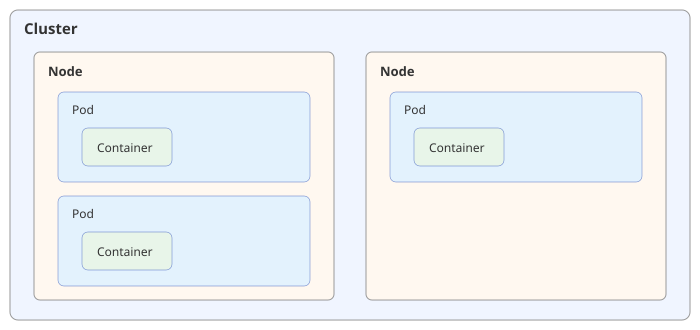

---
hide:
  - navigation
---

# 쿠버네티스 개요

[← Kubernetes로 돌아가기](index.md)

쿠버네티스는 여러 대의 서버에 걸쳐 컨테이너를 자동으로 배치하고 관리해주는 도구입니다. 여기서 컨테이너는 애플리케이션과 실행에 필요한 것들을 하나로 묶어, 어디서든 똑같이 실행할 수 있게 만든 실행 단위입니다.

전체 그림을 이해하려면 쿠버네티스가 다루는 세 가지 기본 단위를 알아야 합니다. 여러 대의 서버를 묶은 **Cluster**, 그 안에서 컨테이너가 실제로 실행되는 서버 한 대인 **Node**, 그리고 쿠버네티스가 배포·관리하는 가장 작은 단위인 **Pod**입니다. Pod는 대부분 컨테이너 하나만 담고 있고, Cluster 안에는 여러 대의 Node가, 각 Node 안에는 여러 개의 Pod가 들어갑니다.

이렇게 단위를 나누는 이유는, 여러 대의 서버(Cluster) 중 어떤 서버(Node)에 무엇(Pod)을 올릴지 쿠버네티스가 자동으로 결정할 수 있게 하기 위해서입니다.

{ width="100%" }

| 구성 요소 | 설명 |
|---|---|
| Cluster | Node들을 하나로 묶은 전체 시스템 |
| Node | 컨테이너가 실제로 실행되는 서버 한 대 |
| Pod | 쿠버네티스가 다루는 최소 배포 단위 (보통 컨테이너 1개) |
| Container | 애플리케이션과 실행에 필요한 것을 묶어 실행하는 단위 |

---

## Cluster는 여러 대의 서버를 하나로 묶습니다

쿠버네티스는 서버 한 대가 아니라 여러 대를 하나의 시스템처럼 다룹니다. 이렇게 묶인 서버 전체를 Cluster라고 부릅니다. 사용자는 서버 한 대씩 따로 관리하지 않고, Cluster 전체에 필요한 걸 한 번에 요청하면 됩니다.

→ **Cluster는 여러 대의 서버를 하나의 관리 단위로 묶어, 개별 서버가 아니라 전체 시스템 관점에서 배포와 운영을 가능하게 합니다.**

## Node는 컨테이너가 실제로 돌아가는 서버입니다

Node는 Cluster를 이루는 서버 한 대입니다. 물리 서버일 수도 있고 가상 머신일 수도 있습니다. 쿠버네티스는 여러 Node의 자원 상황을 보고 어떤 Node에 어떤 컨테이너를 배치할지 자동으로 결정합니다.

→ **Node는 컨테이너가 실제로 실행되는 물리적인 자리이며, 쿠버네티스는 여러 Node에 컨테이너를 적절히 나눠 배치합니다.**

## Pod는 쿠버네티스가 다루는 가장 작은 단위입니다

쿠버네티스는 컨테이너를 직접 다루지 않고, Pod 단위로 다룹니다. 대부분의 Pod는 컨테이너를 하나만 담고 있고, 여러 컨테이너가 항상 함께 실행돼야 할 때만 하나의 Pod에 묶어 담습니다. 쿠버네티스의 자동화 기능은 모두 이 Pod를 기준으로 동작하며, 자세한 내용은 [쿠버네티스를 사용하는 이유](why.md)에서 다룹니다.

→ **Pod는 쿠버네티스가 생성·삭제·이동을 관리하는 최소 단위이며, 쿠버네티스의 모든 자동화 기능은 Pod를 대상으로 동작합니다.**

## Container는 애플리케이션이 실제로 실행되는 단위입니다

Container는 Pod 안에서 실제로 애플리케이션이 동작하는 부분입니다. 컨테이너 자체에 대한 자세한 설명은 [VM과 Container의 차이](vm-vs-container.md)에서 다룹니다.

→ **Container는 쿠버네티스가 다루는 가장 안쪽 단위이며, 이 안에서 실제 애플리케이션 코드가 실행됩니다.**
