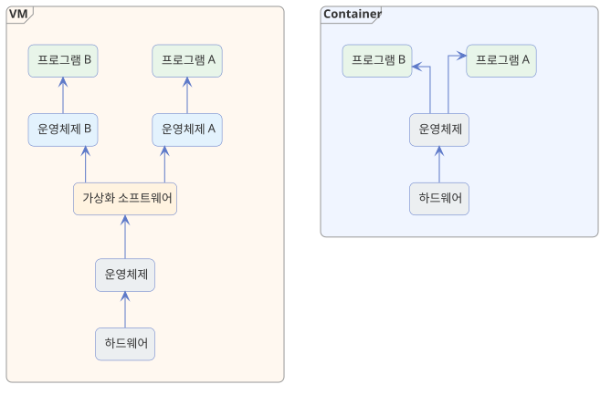

---
hide:
  - navigation
---

# VM과 Container의 차이

[← Kubernetes로 돌아가기](index.md)

VM(가상 머신)과 Container(컨테이너)는 둘 다 "하나의 서버 안에서 여러 프로그램을 격리해서 실행한다"는 목표는 같지만, 격리하는 방식이 다릅니다. VM은 프로그램마다 운영체제를 통째로 새로 띄우고, Container는 운영체제는 그대로 같이 쓰면서 프로그램끼리 서로 못 보게만 나눕니다. 이 차이 때문에 컨테이너가 훨씬 가볍고 빠르게 실행될 수 있고, 결과적으로 쿠버네티스 같은 오케스트레이션 도구가 컨테이너를 다루는 방식으로 자리 잡게 되었습니다.

{ width="100%" }

| 구분 | VM | Container |
|---|---|---|
| 격리 단위 | 하드웨어 전체 | 프로그램 단위 |
| 운영체제 | 프로그램마다 별도 운영체제 실행 | 하나의 운영체제를 같이 사용 |
| 실행 속도 | 부팅 시간 필요 (수십 초~분) | 프로그램 실행 수준 (초 단위 이하) |
| 크기 | 수 GB 이상 | 수십 MB~수백 MB |
| 안전성 | 운영체제까지 따로 있어 더 안전 | 운영체제를 같이 쓰는 만큼 상대적으로 덜 안전 |

---

## VM은 운영체제까지 통째로 새로 띄웁니다

VM은 가상화 소프트웨어(하이퍼바이저라고도 부릅니다. VirtualBox, VMware, KVM 등)가 실제 컴퓨터를 흉내 내고, 그 위에 운영체제를 새로 설치해서 띄우는 방식입니다. 건물 안에 완전히 독립된 또 다른 건물을 통째로 짓는 것과 비슷합니다. 원래 컴퓨터와 다른 종류의 운영체제도 새로 설치해서 쓸 수 있을 만큼 완전히 분리되어 있지만, 그만큼 운영체제 하나를 통째로 부팅해야 하니 무겁고 느리고, 한 대의 서버에 띄울 수 있는 개수도 많지 않습니다.

→ **VM은 운영체제 단위로 통째로 분리되기 때문에 안전하지만, 실행하는 데 시간과 자원이 많이 듭니다.**

## Container는 운영체제를 같이 쓰며 프로그램만 격리합니다

Container는 원래 컴퓨터의 운영체제를 그대로 같이 쓰면서, 운영체제 기능을 이용해 프로그램이 볼 수 있는 파일, 네트워크, 자원만 서로 겹치지 않게 나눕니다. 같은 건물 안에서 방마다 문을 잠가 서로 못 들어가게 나눈 것과 비슷합니다. 새로 건물을 짓지 않으니 방을 만드는 데 걸리는 시간이 훨씬 짧고, 같은 서버 한 대에도 VM보다 훨씬 많은 수를 띄울 수 있습니다. 또한 프로그램을 어디서든 똑같이 실행할 수 있도록 상자처럼 담아둔 것이기도 해서, 개발자의 컴퓨터에서 실행되던 것과 똑같은 모습으로 서버에서도 실행됩니다.

→ **Container는 운영체제를 새로 띄우지 않기 때문에 VM보다 훨씬 가볍고, 초 단위로 빠르게 실행되고 종료됩니다.**

## 이 차이가 쿠버네티스로 이어집니다

컨테이너는 가볍고 빠르게 실행할 수 있는 대신, 그만큼 서비스 하나를 여러 개의 컨테이너로 잘게 쪼개서 운영하는 경우가 많아집니다. 컨테이너 수가 늘어날수록 죽은 컨테이너를 다시 살리고, 트래픽에 맞춰 수를 조절하고, 위치가 바뀐 컨테이너로 접속을 연결해주는 일이 사람 손으로는 감당하기 어려워집니다.

→ **쿠버네티스는 컨테이너이기 때문에 가능해진 이런 빠른 생성·삭제·이동을 자동으로 관리해주는 도구입니다.** ([쿠버네티스를 사용하는 이유](why.md)에서 자세히 다룹니다.)
